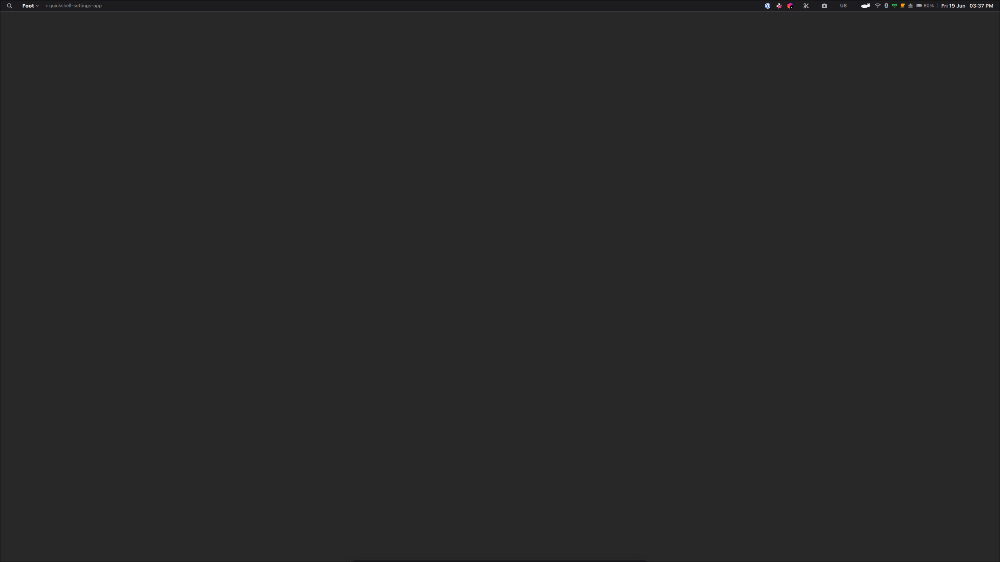
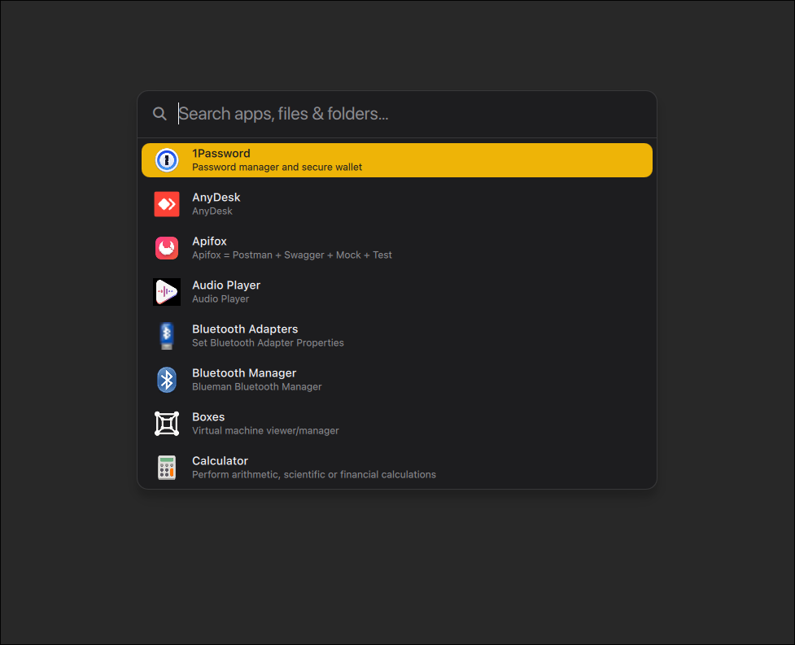
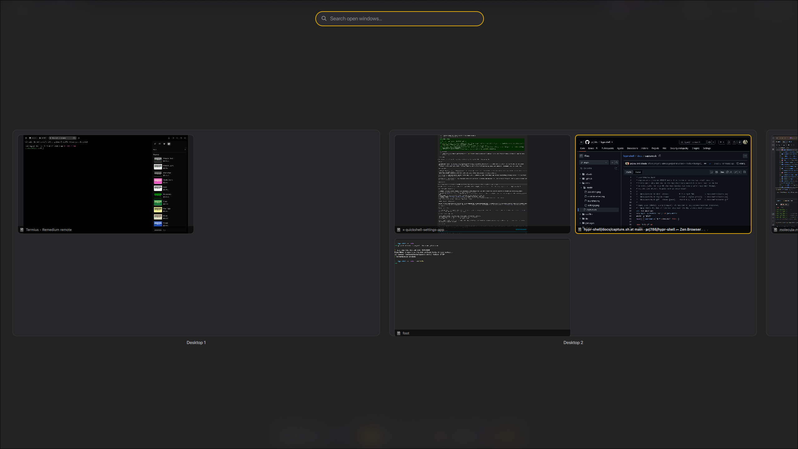
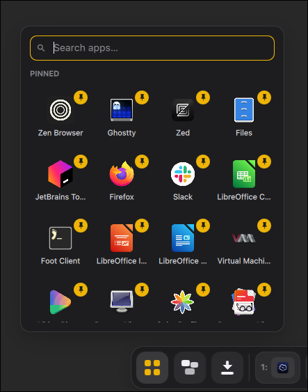
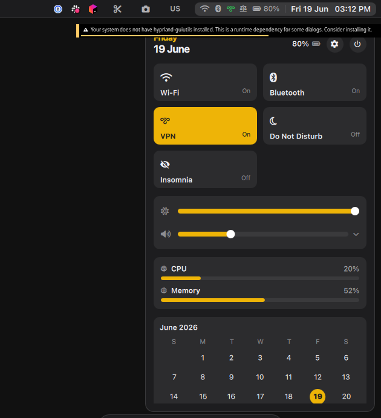
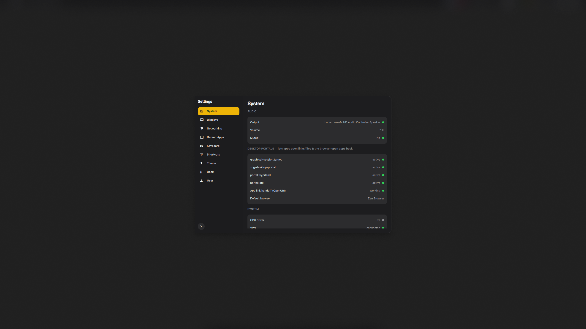
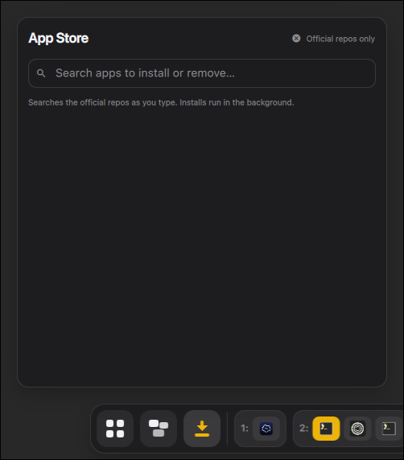
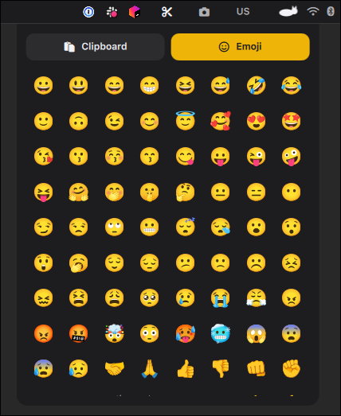
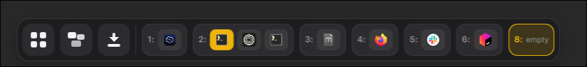

<p align="center">
  
</p>

<p align="center">
  <a href="https://github.com/prj786/hypr-shell/releases"></a>
  <a href="https://github.com/prj786/hypr-shell/actions/workflows/ci.yml"></a>
  
  
  <a href="LICENSE"></a>
</p>

# hypr-shell —  Hyprland + Quickshell desktop (Arch)

An opinionated, installable desktop environment for **Arch Linux**: **Hyprland**
(Wayland compositor, Lua-configured) + **Quickshell** (QML shell — bar, dock,
launcher, notifications, Quick Settings, settings app, lock, OSD, clipboard, an
app installer, a RunCat, and a "Welcome `<user>`" session splash). A Plymouth boot
splash hides the kernel/systemd text before the greeter. One script turns a
minimal Arch install into the full DE.

> **Arch only.** Package install assumes `pacman` + the **AUR**. Arch derivatives
> (EndeavourOS, CachyOS, Garuda, Manjaro) should work. Artix (systemd-free) is
> detected but the service-enable phases are skipped — wire the equivalents into
> your init manually.

## Status

**Alpha — `0.2.0-alpha`.** Usable and daily-drivable, but expect rough edges and
breaking changes between versions. Tested on a minimal Arch install in a QEMU/KVM
VM. Feedback and issues welcome.

Versioning is **semver** (`MAJOR.MINOR.PATCH`) with an `-alpha`/`-beta` pre-release
suffix until the first stable cut. The canonical version lives in the repo-root
**`VERSION`** file; the shell mirrors it in `dotfiles/quickshell/Globals.qml`
(`Globals.version`, shown in the Settings sidebar). Releases are git tags
(`vX.Y.Z`). Bump both on release.

## Screenshots

<p align="center"></p>

| | |
|---|---|
| **Launcher** — fuzzy app / file search<br> | **Window overview** — spaces & open windows<br> |
| **App launcher** — pinned apps from the dock<br> | **Quick Settings**<br> |
| **Settings**<br> | **App installer** — pacman + AUR<br> |
| **Clipboard history**<br> | **Dock**<br> |

<sub>The accent is configurable (Settings → Theme). Regenerate any of these with `docs/capture.sh`.</sub>

## Quick start

```sh
git clone https://github.com/prj786/hypr-shell ~/hypr-shell && cd ~/hypr-shell
bash install.sh              # prompts before each change
# or:
bash install.sh --dry-run    # show everything it would do, change nothing
bash install.sh --yes        # unattended
bash install.sh --check-only # just run the verification checklist
bash install.sh --gaming     # also install the optional gaming stack (Steam, …)
bash install.sh --dev        # also install the front-end dev toolchain (mise/Node, …)
```

The default install is lean: **no gaming and no dev packages** unless you ask.
`--gaming` opts in to Steam, gamescope, gamemode and mangohud (and only then are
[multilib] + the 32-bit GPU drivers enabled); `--dev` opts in to the front-end dev
toolchain (git-delta, lazygit, gh, mise + the Node/LSP stack, ripgrep, fd, fzf,
bat, cmake, meson). A plain `bash install.sh` asks once for each, interactively;
`--yes` skips both. (Flags combine: `--gaming --dev` installs everything unattended
with `--yes`.)

**Updating** is the same command — pull and re-run:

```sh
cd ~/hypr-shell && git pull && bash install.sh
```

The installer is fully **re-runnable**: package installs are skipped if already
present, dotfiles are a symlink farm (re-linking is a no-op), and a package that
isn't in the repos is **warned and skipped** rather than aborting the run — so a
single missing package never blocks the rest of the install.

Run it as your **normal user** (not root) — the AUR helper and `makepkg` refuse
root, and the script uses `sudo` only where it must. Then reboot, pick
**“Hyprland (DE)”** at the greetd/ReGreet login screen, and log in. `Super+,` opens
Settings; full keymap in `dotfiles/hypr/SHORTCUTS.md`.

## What it does (phases)

| Phase | Does |
|------|------|
| 00 preflight | tool/network/disk checks; announces the backup policy |
| 10 repos | bootstraps **paru**; enables **[multilib]** only with `--gaming` (32-bit libs are opt-in) |
| 20 packages | installs `packages/common.list` (pacman) + `packages/aur.list` (AUR); `packages/gaming.list` only with `--gaming`, `packages/dev.list` only with `--dev` |
| 30 services | pipewire/NM/bluetooth/ppd; installs **greetd + ReGreet** (fully-Wayland greeter) + the Wayland session entry |
| 35 bootsplash | **Plymouth** boot splash (Arch logo + spinner): installs the theme, adds the `plymouth` initramfs hook, and adds `quiet splash …` to the kernel cmdline (systemd-boot/GRUB, auto-detected + backed up) so the boot `[OK]` text is hidden |
| 37 cpu microcode | detects the CPU and installs the matching **`intel-ucode`** / **`amd-ucode`**, then wires the early-boot microcode initrd into the bootloader (systemd-boot entry / GRUB regen / UKI rebuild, auto-detected + backed up). Skipped in a VM (the host applies microcode) |
| 40 gpu | per-vendor Vulkan + VAAPI drivers for the detected GPU (Intel `xe` DPMS guard, NVIDIA suspend fix, AMD); mesa-only in a VM |
| 50 dotfiles | symlinks `~/.config/{hypr,quickshell,fresh,kitty,tmux,mise}` (backing up any existing), installs the session target |
| 60 userconfig | default apps (**Fresh** as editor), `EDITOR=fresh`, **mise** Node toolchain (`mise install`), zram (laptops) |
| 90 postcheck | green/red verification checklist |

Everything routes through one `run()`/`sudo_run()` choke point, so `--dry-run` is
genuinely safe and the whole thing is re-runnable.

## Packages

- **`packages/common.list`** — official-repo packages (real Arch names), installed
  with `pacman -S --needed`. Grouped: core session, greeter, audio, network,
  bluetooth, power, terminals, **GTK utility apps** (Nemo, Engrampa, imv, Zathura,
  mpv), browser, utilities, theming + fonts, `git`, core GPU userspace
  (mesa), tuning, build deps.
- **`packages/aur.list`** — AUR packages (built via paru): just `gpu-screen-recorder`.
  Kept deliberately short. Theme/icon/cursor/accent are owned by the Quickshell
  Settings app (no `nwg-look` or other theme-settings GUI).
- **`packages/gaming.list`** — **optional, off by default.** Steam, gamescope,
  gamemode, mangohud + the 32-bit graphics libs. Installed only with
  `install.sh --gaming`, which is also what enables [multilib] and the lib32 GPU
  drivers. A normal install ships **no** gaming packages.
- **`packages/dev.list`** — **optional, off by default.** The front-end dev
  toolchain: git-delta, lazygit, github-cli, mise (+ the Node/LSP stack via
  `mise install` in phase 60), ripgrep, fd, fzf, bat, cmake, meson. Installed only
  with `install.sh --dev`. A normal install ships just `git`.
- **GPU/Vulkan drivers** are *not* in the lists — phase 40 installs the right set
  for the detected vendor (intel / amd / nvidia); the 32-bit ones only with `--gaming`.

### Why traditional GTK apps (not Qt/KDE, not libadwaita)

The shipped first-party apps are **traditional GTK**: **Nemo** (file manager),
**Engrampa** (archives), **imv** (images), **Zathura** (PDF/docs), **mpv** (video).
These use a normal menubar/toolbar + server-side decorations, so under Hyprland —
which draws **no titlebar**, just the accent border — they come up clean, with a
fully borderless look. The "GTK forces an unhideable headerbar" rule only applies
to **GNOME/libadwaita** apps (Nautilus, GNOME Calendar, Evince); ordinary GTK apps
don't, which is why we can have the no-titlebar aesthetic *and* GTK.

Going all-GTK also fixes default-app management: **one `~/.config/mimeapps.list`**
is the single source of truth, read natively by **GIO** — so "Open With" always
sees your installed apps, with no KDE `ksycoca` cache to rebuild (the old Dolphin
"offers to find it in Discover" problem is gone). Manage it from **Settings →
Default Apps**. Right-click **Compress… / Extract Here** in Nemo are shipped as
`system/nemo-actions/*.nemo_action` (calling engrampa).

**Appearance** (light/dark + accent) is applied by
`dotfiles/quickshell/scripts/colorscheme.sh` and toggled live in **Settings →
Theme → App appearance** (defaults to dark):

- **GTK** (primary) — gsettings + `gtk-3.0/4.0/settings.ini` (adw-gtk3[-dark]);
  accent changes recolour GTK apps live.
- **Qt** — `qt6ct`/`qt5ct` write a dark **Fusion** palette
  (`QT_QPA_PLATFORMTHEME=qt6ct`) so any *stray* Qt app you install — and the
  Quickshell shell's own Qt dialogs — stay dark instead of blinding white. No
  `plasma-integration`/KDE platform theme: we ship no KDE apps. A `kdeglobals`
  fallback is still written so a KDE app added later is dark too.
- **Icons** — **Reversal**, auto-matched to the accent by hue (`Reversal-<colour>[-dark]`).
- **Cursor** — **Mocu** (`mocu-xcursor`), forced via `XCURSOR_THEME`,
  `~/.icons/default`, GTK, gsettings and qt6ct so it never flips between toolkits.

The **app installer** inside the DE (dock “store” button) searches and
installs/removes via **pacman + AUR** (not Flatpak) — actions open a terminal so
you drive the sudo/build steps.

## Safety

- **Never clobbers configs.** An existing `~/.config/hypr` (etc.) is moved to
  `…​.bak.<timestamp>` before the symlink is created; `uninstall.sh` restores it.
- **Symlink farm, not copy** — re-running re-links (no-op); `uninstall.sh` unlinks
  and restores the newest backup. Packages are left installed (use `--purge` to
  also disable the display manager).
- The single most important step is the **`hyprland-session.target`** user unit
  (`BindsTo=graphical-session.target`) — it activates `xdg-desktop-portal` on a
  non-uwsm session. Without it, screen sharing, file pickers, and app/URL handoff
  silently fail.
- **User-state files** (`user-theme.json`, `pinned-apps.json`, `generated/user.lua`)
  are gitignored; committed `*.default` templates seed them only when missing, so a
  fresh clone has working defaults while your edits are never committed or clobbered.

## Repo layout

```
install.sh  uninstall.sh  VERSION (project semver)  VERSIONS (min tool versions)
lib/      log.sh detect.sh pkg.sh deploy.sh
packages/ common.list  aur.list
phases/   00…90
dotfiles/ hypr/  quickshell/      ← the actual configs, symlinked into ~/.config
systemd/  hyprland-session.target ← the portal-activation fix
system/   greetd/                ← greetd + ReGreet configs, installed to /etc by phase 30
templates/hyprland-de.desktop.in  ← rendered into the wayland-sessions dir
```

## Hardware notes: Intel Lunar Lake / Arc 140V

On Intel Lunar Lake (Arc 140V), the `xe` kernel driver has a DPMS-resume bug that
can strand a black screen, so the shipped `hypridle.conf` locks but **never powers
the panel off**. If the iGPU tears or hangs, logging in once with
`DE_SOFTWARE_RENDER=1` set falls back to software rendering (see
`dotfiles/hypr/start-hyprland.sh`). Hardware without this bug is unaffected and can
re-enable panel-off in `hypridle.conf`.

## Roadmap

**Shipped (`0.2.0-alpha`)** — Hyprland + Lua config, top bar, dock, launcher
(Launcher), native notifications, Quick Settings, settings app, session lock, OSD,
clipboard history, polkit agent, system tray, screenshots, XDG portals, greeter,
Plymouth boot splash + welcome splash, traditional-GTK app stack with one-file
default-app management, live theming + accent, shell crash-respawn, idle-suspend +
low-battery safety; hardware-aware install — per-CPU microcode, robust GPU-vendor
detection, real-hardware audio firmware (SOF) — and opt-in `--gaming` / `--dev`
package stacks for a lean default install.

**Next** — live on the [project board](https://github.com/users/prj786/projects/5):

- [ ] [Multi-monitor hotplug hardening](https://github.com/prj786/hypr-shell/issues/1) (clean reflow on plug/unplug)
- [ ] [Input method (IME) support](https://github.com/prj786/hypr-shell/issues/2) for CJK / complex scripts
- [ ] [External-monitor brightness (DDC/CI)](https://github.com/prj786/hypr-shell/issues/3)
- [ ] [Polished demo GIFs in the README](https://github.com/prj786/hypr-shell/issues/4)
- [ ] [Wider real-hardware testing](https://github.com/prj786/hypr-shell/issues/5) (beyond Lunar Lake + the VM)

Tracked on the [project board](https://github.com/users/prj786/projects/5) ·
[Issues](https://github.com/prj786/hypr-shell/issues) ·
[Discussions](https://github.com/prj786/hypr-shell/discussions).

## Known limitations (alpha)

Set expectations before you daily-drive it:

- **The screen never powers off on idle** (only locks) — a deliberate workaround
  for the Lunar Lake `xe` DPMS-resume bug above. On a laptop that means a lit,
  locked panel while idle. Re-add a `dpms off` listener in `hypridle.conf` on
  hardware without the bug.
- **Idle behaviour, laptop on battery:** locks at 5 min, **suspends at 15 min**
  (only on battery — never on a desktop or while plugged in). Delete the second
  listener in `hypridle.conf` to disable.
- **Low battery is handled automatically:** a warning at 20% and 10%, and a
  **suspend at 5%** to protect unsaved work. Don't expect a second prompt — it
  acts to avoid a hard power-off.
- **The shell auto-respawns.** Quickshell runs as a `Restart=on-failure` systemd
  user service (`hypr-shell.service`), so a crash brings the bar/dock/lock back
  on its own. The lock uses the Wayland session-lock protocol, so the outputs
  stay locked even if the shell dies while locked.
- **The session lock is a new Quickshell component**, not battle-tested hyprlock.
  It works, but it's the youngest security-relevant piece — report anything off.
- **Multi-monitor hotplug is lightly tested.** Initial layouts and the
  Settings → Displays pane work; plug/unplug reflow needs more mileage.
- **No input method (IME) yet** — CJK / complex-script input isn't wired.
- Tested on a minimal Arch install in a QEMU/KVM VM; real-hardware coverage is
  still thin. Issues and PRs welcome.

## Bugs & feedback

It's alpha — reports genuinely help. Pick the right door:

- 🐛 **[Report a bug](https://github.com/prj786/hypr-shell/issues/new?template=bug_report.yml)** — the form asks for your GPU, version, and `install.sh --check-only` output. (Check [Known limitations](#known-limitations-alpha) first — some behaviour is intentional.)
- 💡 **[Request a feature](https://github.com/prj786/hypr-shell/issues/new?template=feature_request.yml)**
- 💬 **[Discussions](https://github.com/prj786/hypr-shell/discussions)** — questions, setup help, ideas, and a *Show and tell* for your own accent/wallpaper. Start at the [welcome post](https://github.com/prj786/hypr-shell/discussions/6).
- 🔒 **Security** — report privately via the repo's **Security → Report a vulnerability** tab; see [SECURITY.md](SECURITY.md).

## Credits

Designed and built by **scubba**, pair-programmed with **[Claude Code](https://claude.com/claude-code)** (Anthropic's Claude) — which scaffolded the installer, the Quickshell components, and this documentation.

Built on the work of the [Hyprland](https://hypr.land) and [Quickshell](https://quickshell.org) projects.

## License

**GPL-2.0-only** — see [LICENSE](LICENSE). Like the Linux kernel: use it, study it,
share it, and build on it freely; but if you distribute a modified version, your
changes must ship under the same terms (copyleft). Improvements are welcome
upstream via pull request.
